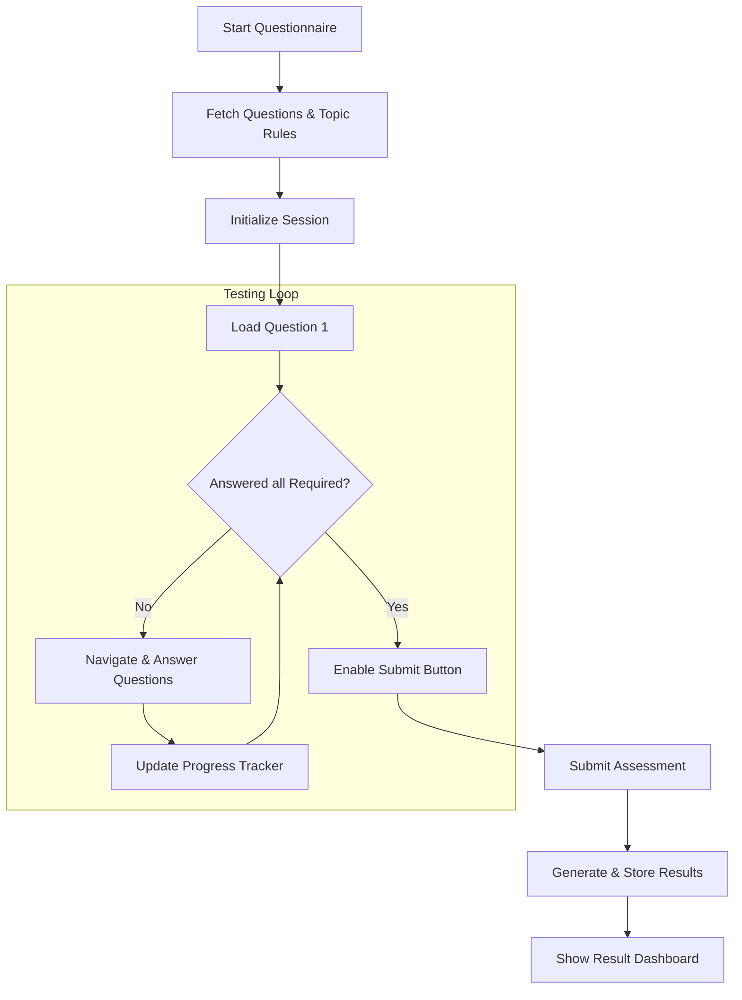

# Questionnaire System Guide 📝

This guide provides an in-depth look at the refactored Questionnaire system, its features, and the technical implementation of its UI/UX components.

---

## 🏗️ System Overview

The Questionnaire system is a highly dynamic, process-aware assessment engine. It ensures that users are tested according to specific rules defined by administrators, with a focus on topic-specific requirements and process-based aesthetics.

### 🔄 User Flow Diagram

The following diagram illustrates the flow from session initialization to submission, highlighting the new requirement-locked validation.



---

## ✨ Advanced Features

### 🎨 Dynamic Process Theming
The UI automatically detects the user's assigned process (e.g., Vision Plus, ElderLine) and applies a unique theme.
- **Header & Icons**: Colors change to match the process identity.
- **Progress Elements**: Bars and indicators follow the process color palette.
- **Interactive States**: Buttons and selection rings adapt dynamically.

### 📊 Real-time Progress Tracker
The sidebar provides a granular view of the user's progress:
- **Category Progress**: Shows `Answered / Required` questions for each specific topic.
- **Assignment Counts**: Displays the total number of questions assigned by the admin for each category.
- **Mini-Progress Bars**: Visual indicators that turn emerald once a topic's requirement is met.

### ✅ Requirement-Locked Submission
To ensure assessment integrity, the submission logic is strictly controlled:
1. **Rule Validation**: The system checks `minAttempt` and `requiredAttempt` for every category.
2. **Button Interactivity**: The "Submit" button is physically disabled and visually greyed out until all criteria are satisfied.
3. **User Guidance**: Hovering over the disabled button provides a hint on why submission is locked.

---

## 🛠️ Technical Implementation

### 📁 Component Structure
- **[page.tsx](app/Questionnaire/page.tsx)**: The main client-side container managing state for answers, flags, and navigation.
- **Process Context**: Uses `useProcess()` to retrieve styling data and process names.
- **Navigator Sidebar**: Dynamically groups questions using `useMemo` for high performance.

### 🧪 Validation Logic
The system uses a memoized check to determine if all requirements are met:

```typescript
const allRequirementsMet = useMemo(() => {
  return categories.every(cat => {
    const progress = getCategoryProgress(cat);
    const target = progress.required ?? progress.min;
    return progress.answered >= target;
  });
}, [rules, answers]);
```

---

## 📈 Database Interaction

When a user completes the assessment, the system saves a comprehensive snapshot:
- **Score & Percentage**: Calculated server-side for accuracy.
- **Category Breakdown**: Stores how the user performed in each specific topic.
- **Answer Snapshot**: Saves every answer provided for audit purposes.

---

## 🧭 Navigation & UX
- **Flagging**: Users can mark difficult questions for later review.
- **Time Management**: Integrated timer with pause/resume functionality.
- **Keyboard Friendly**: Designed for quick navigation between questions.
