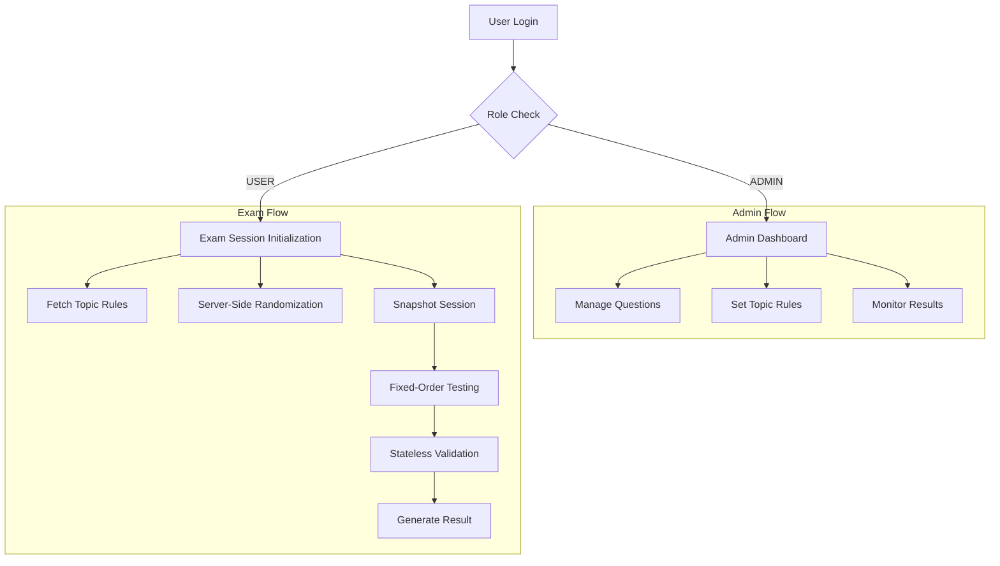
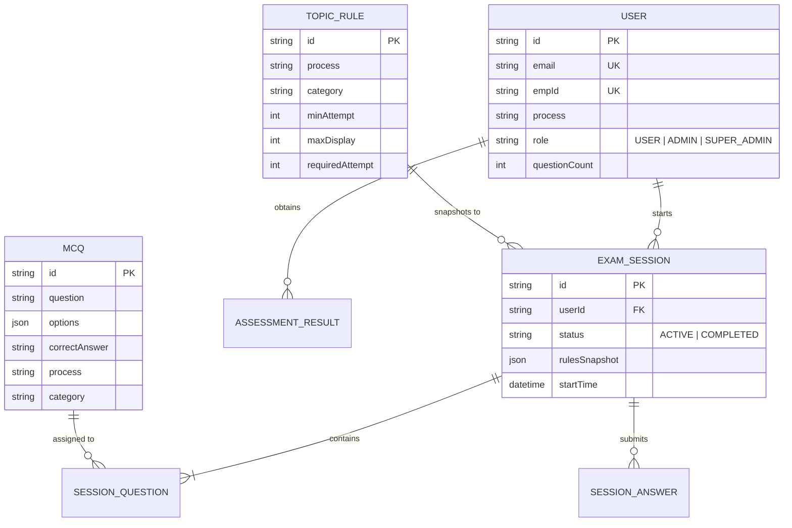
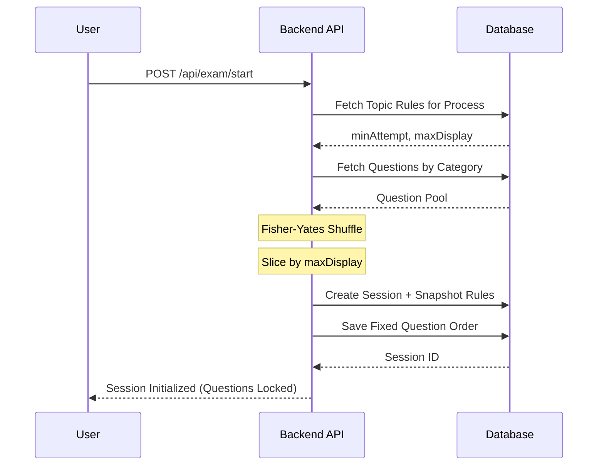

# Vision Plus Training Assessment Portal 🚀

A scalable, production-grade examination system built with **Next.js**, **Prisma**, and **PostgreSQL**. Designed for high-integrity assessments with server-side randomization, topic-based rule control, and real-time admin oversight.

---

## 🏗️ System Architecture

The portal follows a **Session-Snapshot Architecture**. This ensures that once an exam starts, the rules and questions are locked, protecting the integrity of the assessment from administrative changes mid-test.



---

## 📊 Database Schema

The system uses a relational model optimized for performance and auditability.



---

## 🔄 Core Workflows

### 1. Server-Side Randomization
To prevent cheating and ensure fairness, questions are selected and ordered exclusively on the backend.



### 2. Result Validation
Validation occurs on the backend during submission, cross-referencing the initial rule snapshot.

---

## ✨ Key Features

- **🛡️ High Integrity**: Randomization occurs only once per session. Refreshing the browser preserves the same questions in the same order.
- **🏷️ Topic-Based Control**: Admins can define exactly how many questions from each category (e.g., "Aadhaar Basics", "ElderLine Protocol") must be attempted.
- **🏢 Multi-Process Support**: Role-based access control (RBAC) allows Process Admins to manage their specific departments without seeing others.
- **📈 Real-time Analytics**: Detailed breakdown of correct/wrong answers, percentages, and completion status.
- **🧠 Intelligent Normalization**: Handles inconsistent data entry (e.g., "ElderLine" vs "Elder Line") automatically using a normalization layer.

---

## 🛠️ Tech Stack

- **Frontend**: Next.js 14 (App Router), Tailwind CSS, Lucide React, Shadcn UI
- **Backend**: Next.js API Routes, Prisma ORM
- **Database**: PostgreSQL (Neon.tech)
- **State Management**: React Context API
- **Visualization**: Mermaid.js for architecture diagrams

---

## 🚀 Getting Started

1. **Install Dependencies**:
   ```bash
   npm install
   ```

2. **Setup Environment**:
   Create a `.env` file with your `DATABASE_URL`.

3. **Sync Database**:
   ```bash
   npx prisma db push
   npx prisma generate
   ```

4. **Run Development Server**:
   ```bash
   npm run dev
   ```

---

## 🚀 Deployment (GCP Cloud Run)

The project includes a production-ready CI/CD pipeline via GitHub Actions.

### 🔐 Required GitHub Secrets
To enable automatic deployment, add these to **Settings > Secrets and variables > Actions**:

| Secret | Description | Where to find |
| :--- | :--- | :--- |
| `GCP_PROJECT_ID` | Your Google Cloud Project ID | GCP Console Dashboard |
| `GCP_SA_KEY` | Service Account JSON Key | IAM > Service Accounts > Keys (needs Cloud Run Admin) |
| `GCP_REGION` | Deployment Region | e.g., `asia-south1` |
| `DATABASE_URL` | Production Postgres URL | From your DB provider (e.g., Neon, Supabase, Cloud SQL) |
| `NEXTAUTH_SECRET` | Auth Encryption Key | Generate using `openssl rand -base64 32` |
| `NEXTAUTH_URL` | App Public URL | Your Cloud Run Service URL (e.g., `https://app-xyz.a.run.app`) |

---

## 🏗️ Jenkins CI/CD Setup

To use the custom Jenkins pipeline:

1.  **Build Jenkins Image**:
    ```bash
    docker build -t custom-jenkins -f Jenkins.Dockerfile .
    ```
2.  **Run Jenkins**:
    ```bash
    docker run -p 8080:8080 -p 50000:50000 -v jenkins_home:/var/jenkins_home -v /var/run/docker.sock:/var/run/docker.sock custom-jenkins
    ```
3.  **Configure GitHub Webhook**:
    *   In Jenkins: Install **GitHub Integration Plugin**.
    *   In GitHub: Go to **Settings > Webhooks > Add webhook**.
    *   Payload URL: `http://your-jenkins-url:8080/github-webhook/`.
    *   Content type: `application/json`.
    *   Events: `Just the push event`.
4.  **Configure Jenkins Credentials**:
    *   Go to **Manage Jenkins > Credentials > System > Global credentials**.
    *   Add **Secret text**:
        *   ID: `DATABASE_URL`, Secret: `your-postgres-url`.
    *   Add **Secret file**:
        *   ID: `gcp-sa-key`, File: `your-gcp-service-account-json-key`.

---

*Developed with ❤️ by Abhishek John Charan for Vision Plus Training Assessment.*
